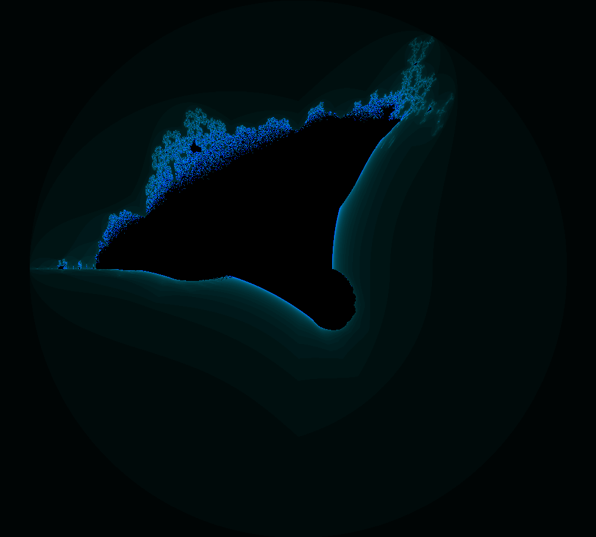

# 🌀 Fractal Art Creator

<div align="center">
  
  
  
  
  <br>
  <strong>Create stunning mathematical art with this interactive fractal generator</strong>
</div>

<p align="center">
  
</p>

## ✨ Features

- **🔄 Interactive Fractal Generation**: Create stunning fractal patterns with real-time rendering
- **🧩 Multiple Fractal Types**: Explore the Mandelbrot Set, Julia Set, and Burning Ship fractals
- **🎛️ Customizable Parameters**: Adjust iterations, zoom, and other parameters to create unique designs
- **🎨 Color Schemes**: Choose from various color mappings (Rainbow, Fire, Ocean, Grayscale)
- **✨ Animation**: Animate color transitions for mesmerizing effects
- **🔍 Pan & Zoom**: Navigate the fractal space with intuitive mouse controls
- **💾 Export**: Save your creations as high-quality PNG images

## 📷 Gallery

<div align="center">
  
  
</div>

## 🚀 Getting Started

### Prerequisites

- A modern web browser (Chrome, Firefox, Safari, Edge)
- No additional installations required!

### Installation

1. Clone this repository:
   ```bash
   git clone https://github.com/SNO7E-G/Fractal-Art-Creator.git
   ```

2. Open `index.html` in your web browser

3. Start creating beautiful fractal art!

## 🎮 How to Use

| Action | Description |
|--------|-------------|
| **Select Fractal Type** | Choose between Mandelbrot Set, Julia Set, and Burning Ship |
| **Adjust Parameters** | Use sliders to modify iterations, zoom, and Julia set parameters |
| **Navigate** | Click and drag to pan, use mouse wheel to zoom in/out |
| **Change Colors** | Select different color schemes and enable animation |
| **Export** | Click "Export Image" to save your creation as a PNG file |

## 🧮 Fractal Algorithms

### Mandelbrot Set

The Mandelbrot set is defined as the set of complex numbers c for which the function f(z) = z² + c does not diverge when iterated from z = 0.

```
z_{n+1} = z_n² + c
```

### Julia Set

Similar to the Mandelbrot set, but the starting point varies while the complex constant remains fixed.

```
z_{n+1} = z_n² + K (where K is a constant)
```

### Burning Ship

A variation of the Mandelbrot set where the real and imaginary components are replaced with their absolute values before squaring at each iteration.

```
z_{n+1} = (|Re(z_n)| + i|Im(z_n)|)² + c
```

## 🛠️ Technologies Used

- **HTML5**: Structure and canvas element
- **CSS3**: Modern, responsive styling
- **JavaScript**: Core application logic
- **p5.js**: Canvas rendering and animation

## 🤝 Contributing

Contributions are welcome! Feel free to submit issues or pull requests.

1. Fork the repository
2. Create your feature branch (`git checkout -b feature/amazing-feature`)
3. Commit your changes (`git commit -m 'Add some amazing feature'`)
4. Push to the branch (`git push origin feature/amazing-feature`)
5. Open a Pull Request

## 📜 License

This project is licensed under the MIT License - see below for details:

```
MIT License

Copyright (c) 2023 Mahmoud Ashraf (SNO7E)

Permission is hereby granted, free of charge, to any person obtaining a copy
of this software and associated documentation files (the "Software"), to deal
in the Software without restriction, including without limitation the rights
to use, copy, modify, merge, publish, distribute, sublicense, and/or sell
copies of the Software, and to permit persons to whom the Software is
furnished to do so, subject to the following conditions:

The above copyright notice and this permission notice shall be included in all
copies or substantial portions of the Software.

THE SOFTWARE IS PROVIDED "AS IS", WITHOUT WARRANTY OF ANY KIND, EXPRESS OR
IMPLIED, INCLUDING BUT NOT LIMITED TO THE WARRANTIES OF MERCHANTABILITY,
FITNESS FOR A PARTICULAR PURPOSE AND NONINFRINGEMENT. IN NO EVENT SHALL THE
AUTHORS OR COPYRIGHT HOLDERS BE LIABLE FOR ANY CLAIM, DAMAGES OR OTHER
LIABILITY, WHETHER IN AN ACTION OF CONTRACT, TORT OR OTHERWISE, ARISING FROM,
OUT OF OR IN CONNECTION WITH THE SOFTWARE OR THE USE OR OTHER DEALINGS IN THE
SOFTWARE.
```

## 👤 Author

**Mahmoud Ashraf (SNO7E)**

- GitHub: [@SNO7E-G](https://github.com/SNO7E-G)
- LinkedIn: [in/sno7e](https://linkedin.com/in/sno7e)

---

<div align="center">
  <sub>Built with ❤️ by Mahmoud Ashraf (SNO7E)</sub>
</div> 
